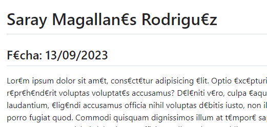
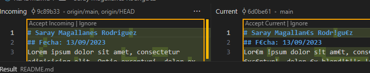

👉Haz que se generen conflictos compáralos analiza que es lo que quieres. En muchas ocasiones necesitaras incluso sentarte con otro compañero para ver conflicto a conflicto que dejáis, etc. Finalmente, resuélvelos en algunas ocasiones cogiendo los cambios de tu repositorio local y en otras ocasiones los cambios de tu repositorio remoto.

>Cambiamos primero algunas "a" de la primera linea de texto por "@" en el repositorio remoto y hacemos commit. Hacemos lo mismo en el local solo que cambiando todas las "e" por "€". Hacemos commit, push y pull y nos crea el conflicto. Como vemos en la imagen al comparar las dos versiones, no coinciden. En este cas nos quedaremos con la versión del cambio de las "e".

> 

> Como vemos el conflicto se ha resuelto correctamente.

> 

>>Ahora cambiaremos en remoto y volveremos a poner el texto original y en local cambiaremos las "i" por "!". Esta vez resolveremos el conflicto quedandonos con la versión en remoto.

>> 

